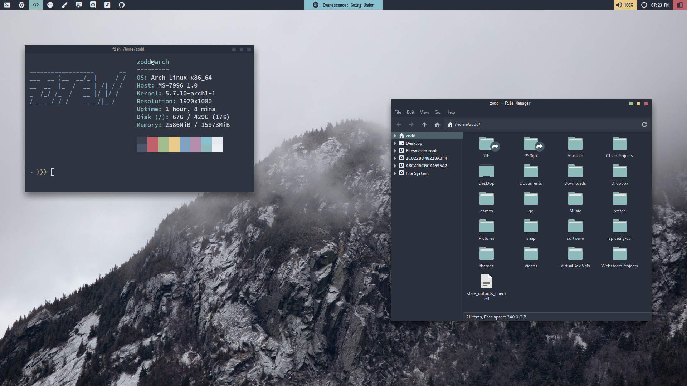

# dotfiles

Hello there!

Those are my different bspwm and openbox themes dotfiles, hope you find something useful in this mess ^^

# Theme Previews

## PinkNord


<br/><br/>

## Nord


<br/><br/>

## Gruvbox


<br/><br/>

## Dracula


<br/><br/>

## SolarizedDark


<br/><br/>

## AlternativeGruvbox


<br/><br/>

## DOOMBOX


<br/><br/>

# Install

## [WARNING]: Installation scripts are still work in progress. Use them at your own risk!!
### [WARNING!]: These are my personal config files, executing these scripts will overwrite several files in your system, only execute these in case you have a backup of your files.

You can install one of them by running the setup executable.

Installing necessary packages:

[WARNING!]: Support for Arch Linux based systems only (installation via pacman).

Use:

```shell
./setup.sh <ARG> 
```

where 
```<ARG>```
may be:

```
general      - installs necessary packages from pacman
aur          - installs necessary packages from AUR and external sources
themes       - installs .themes, .icons, .fonts, wallpapers and necessary/personal scripts
```

You can also do:


```shell
./setup.sh <ARG> <THEME_NAME>
```

where 
```<ARG>```
may be:

```
rice         - installs <RICE_NAME> rice
all          - installs all packages and finally installs <RICE_NAME> theme if this argument was passed
```

where 
```<RICE_NAME>```
may be:

```
pink-nord               - Pink Nord look
gruvbox                 - Classic Gruvbox look
```

# Deprecated (old rices, they need a lot of cleaning)
```
nord                    - Classic Nord look
dracula                 - Classic Dracula look
doombox                 - Doom version of gruvbox
alternative-gruvbox     - Atypical version of gruvbox with lightly changed palette
solarized-dark          - Solarized Dark theme with a small vaporwave flavour (with some pinkier colors)
```

