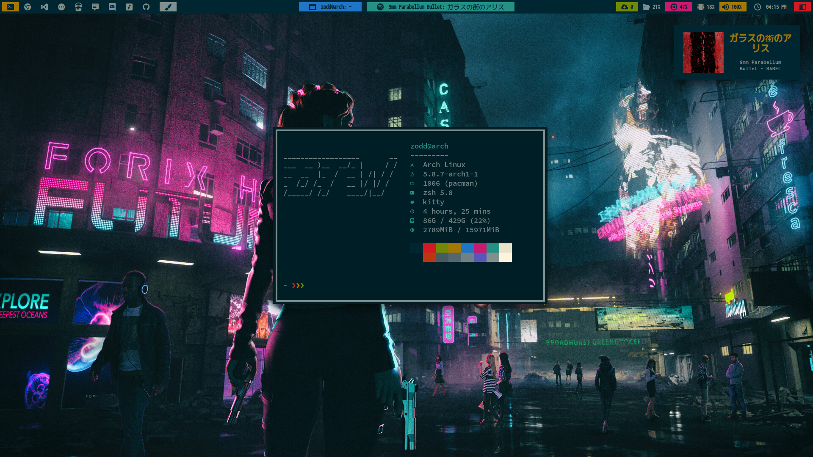
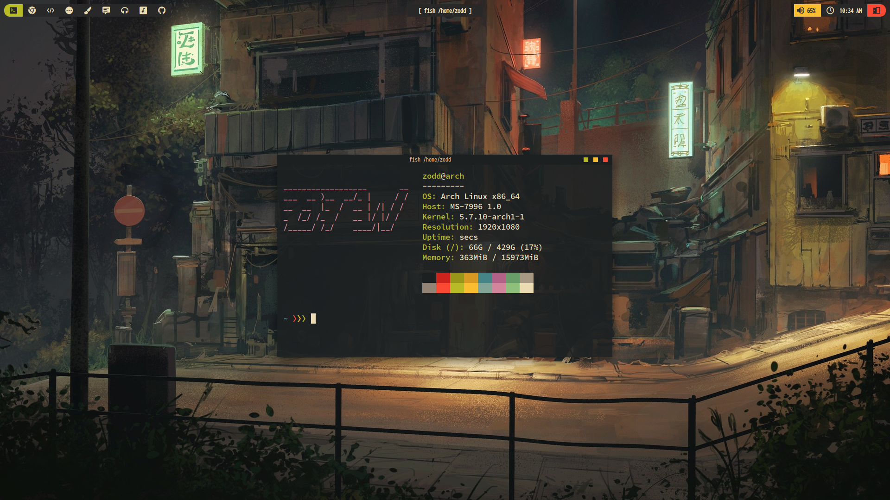
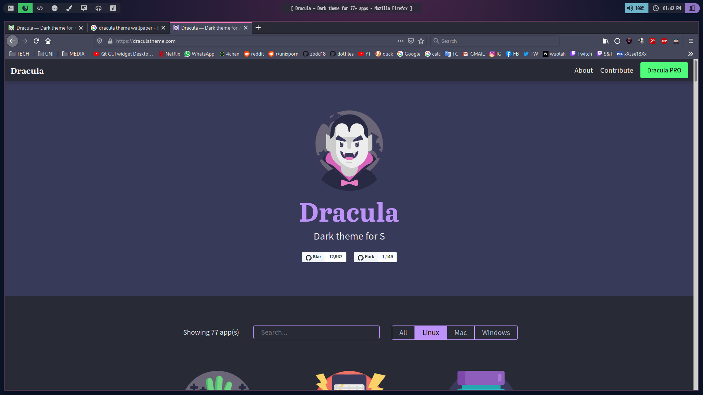
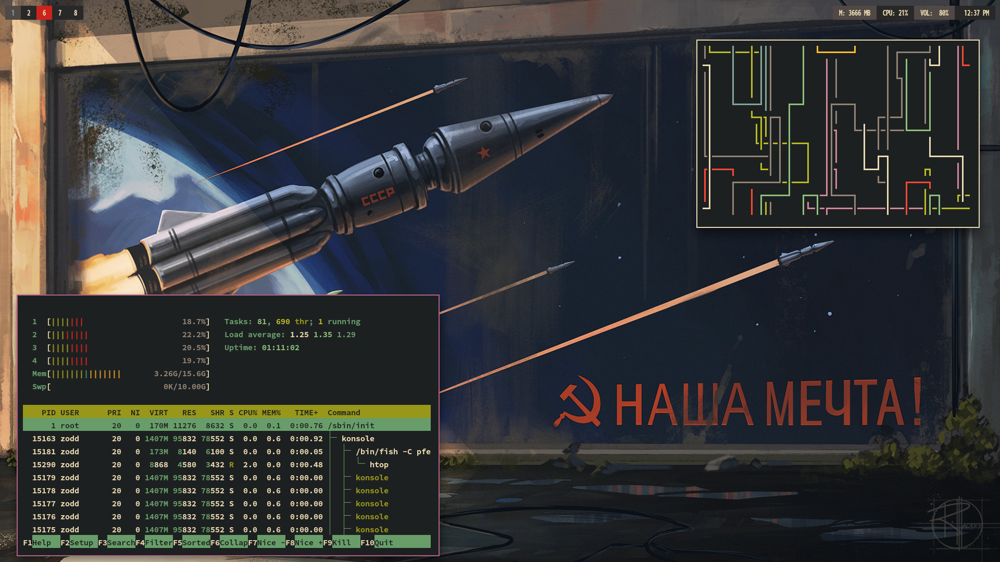
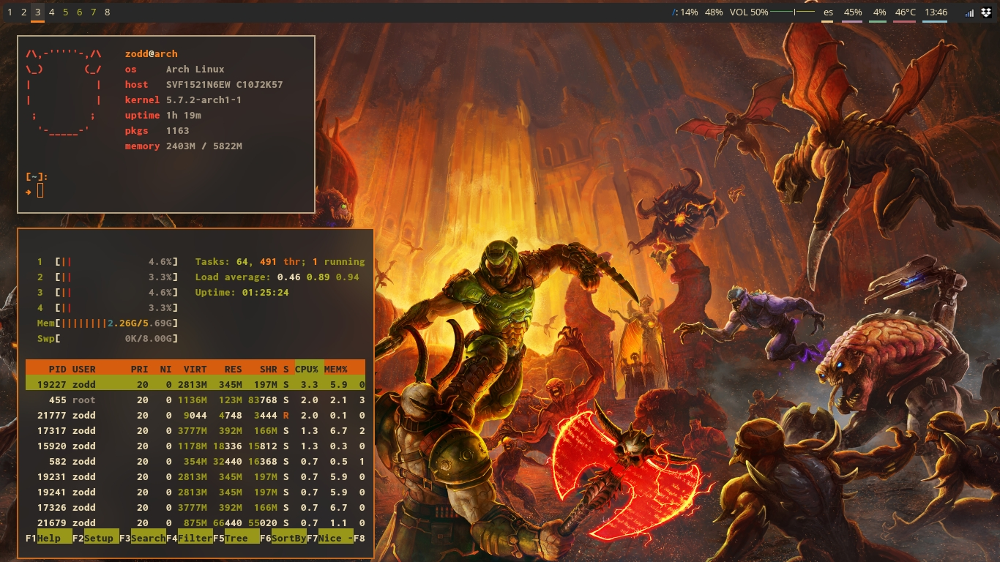

# dotfiles

Hello there!

Those are my different bspwm themes dotfiles, hope you find something useful in this mess hehe ^^

# Theme Previews

## SolarizedDark


<br/><br/>

## Gruvbox


<br/><br/>

## Dracula


<br/><br/>

## AlternativeGruvbox


<br/><br/>

## DOOMBOX


<br/><br/>

# Install

## [WARNING!]: These are my personal config files, I don't recommend using this script since this will overwrite several files in your system, only execute this in case you have a backup of your files.

You can install one of them by running the setup executable.

Installing necessary packages:

[WARNING!]: Support for Arch Linux based systems only (installation via pacman).

Use:

```shell
./setup.sh <ARG> 
```

where 
```<ARG>```
may be:

```
general      - installs necessary packages from pacman
git          - installs necessary packages from AUR and github
wifi         - (only for wireless connection!) installs 2 packages for wireless connection support
```

You can also do:


```shell
./setup.sh <ARG> <THEME_NAME>
```

where 
```<ARG>```
may be:

```
theme        - installs <THEME_NAME> theme
all          - installs all packages and finally installs <THEME_NAME> theme if this argument was passed
```

where 
```<THEME_NAME>```
may be:

```
gruvbox                 - Classic Gruvbox look
dracula                 - Classic Dracula look
doombox                 - Doom version of gruvbox
alternative-gruvbox     - atypical version of gruvbox with lightly changed palette
solarized-dark          - Solarized Dark theme with a small vaporwave flavour (with some pinkier colors)
```
