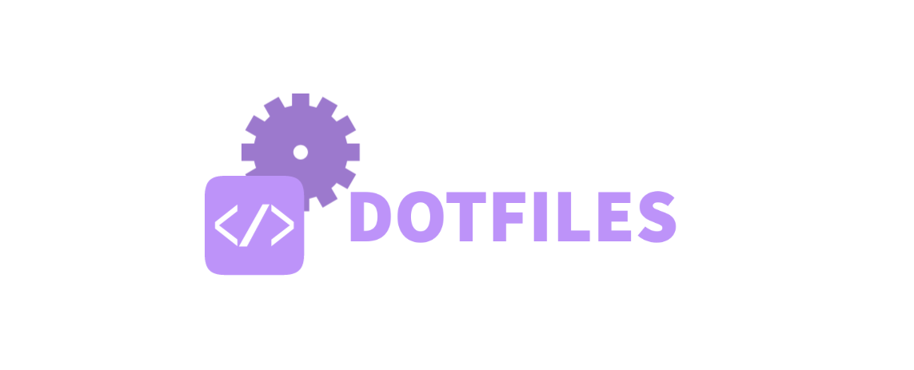
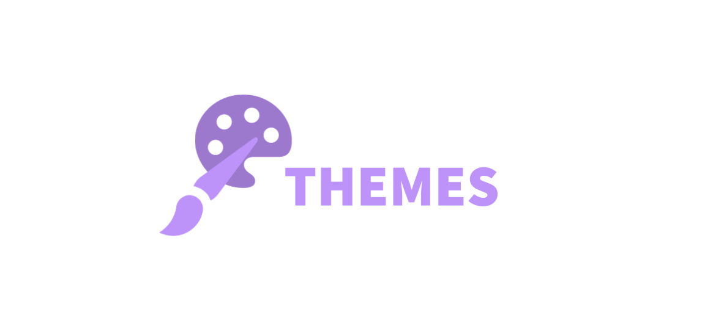
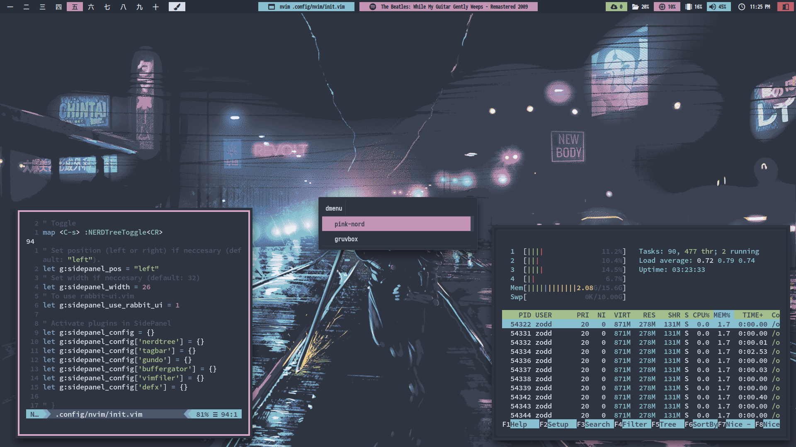
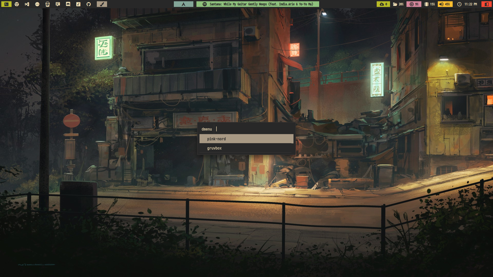

### Hello there! :octocat:

Those are my bspwm dotfiles, hope you find something useful here ^^

Specific rices configs and colorschemes are [here](https://github.com/zodd18/dotfiles/tree/master/rices) and general configuration files are [here](https://github.com/zodd18/dotfiles/tree/master/shared-config). You will need both.

Here are some details about my setup:
<a href="https://youtu.be/_PTp5mh5_vQ"></a>
- **WM**                           : [bspwm](https://github.com/baskerville/bspwm) :art: several switchable themes!
- **Shell**                        : [zsh](https://wiki.archlinux.org/index.php/zsh) :shell: with [oh my zsh](https://github.com/ohmyzsh/ohmyzsh) framework!
- **Terminal**                     : [kitty](https://github.com/kovidgoyal/kitty) :cat:
- **Panel**                        : [polybar](https://github.com/polybar/polybar) :shaved_ice: using [nerd fonts](https://github.com/ryanoasis/nerd-fonts) glyphs as icons!
- **Compositor**                   : [picom](https://github.com/chjj/compton) :sparkles:
- **Notify Daemon**                : [Dunst](https://wiki.archlinux.org/index.php/Dunst) :leaves: minimalism!
- **Application Launcher**         : [Rofi](https://github.com/davatorium/rofi) :rocket: apps & sidebar menu!
- **File Manager**                 : [Thunar](https://wiki.archlinux.org/index.php/Thunar) :bookmark: customized sidebar & icon!
- **Text Editor**                  : [nvim](https://github.com/neovim/neovim) :computer:



## [🍁 Horizon](https://github.com/zodd18/Horizon)
 


<br/><br/>

## [❄️ Nord](https://github.com/zoddDev/Nord) (using  decorations)
 


<br/><br/>

## [🌲 Forest](https://github.com/zodd18/Forest)
 


<br/><br/>

## [🌴 Gruvbox](https://github.com/zodd18/Gruvbox)
 


<br/><br/>

## [🌸 PinkNord](https://github.com/zodd18/PinkNord)
 


<br/><br/>

## [🌊 SolarizedDark](https://github.com/zodd18/SolarizedDark)
 


<br/><br/>

## [🎀 PinkNordAlternative](https://github.com/zodd18/PinkNordAlternative) (using [Fleon](https://github.com/owl4ce/dotfiles) colorscheme)
 


<br/><br/>

## [🔥 DOOMBOX](https://github.com/zodd18/Doombox)
 

<br/><br/>

# Custom Theme Swap Utility

## Click the brush icon


## Choose the rice that you desire


## Nice! Now you have a completely look and feel for your Linux desktop!



### [WARNING!]: These are my personal config files, executing these scripts will overwrite several files in your system, only execute these in case you have a backup of your files.

## Download
```
mkdir -p ~/Documents/git-lab && git clone --depth=1 https://github.com/zoddDev/dotfiles.git ~/Documents/git-lab/dotfiles && cd ~/Documents/git-lab/dotfiles
```

## Installation
You can install one of them by running the setup executable.

Installing necessary packages:

[WARNING!]: Support for Arch Linux based systems only (installation via pacman).

Use:

```shell
./setup.sh <ARG> 
```

where 
```<ARG>```
may be:

```
packages        - installs needed packages using yay (also installs yay if needed)
themes          - installs needed general .themes, .icons, .fonts, wallpapers and necessary scripts
```

You can also do:


```shell
./setup.sh <ARG> <RICE_NAME>
```

where 
```<ARG>```
may be:

```
rice         - downloads (if needed) and installs <RICE_NAME> rice
all          - installs all at once: packages, GTK themes, etc. And finally installs <RICE_NAME> theme if this argument was passed
```

where 
```<RICE_NAME>```
may be:

```
nord                    - Nord theme
dracula                 - Dracula theme
gruvbox                 - Gruvbox theme
gruvbox-material        - Soft edition of Gruvbox theme
solarized-dark          - Solarized Dark theme
horizon                 - Based on VS Code Horizon theme
forest                  - Everforest theme
pink-nord               - Pink Nord theme
pink-nord-alternative   - Based on Fleon theme
doombox                 - Doom version of gruvbox theme
```

example:

```
setup.sh all horizon
```
(this command would install all necessary packages, themes, icons and would install horizon rice)
