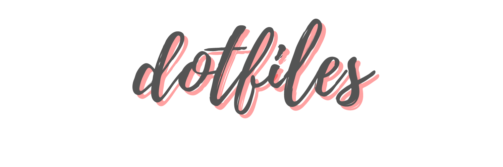
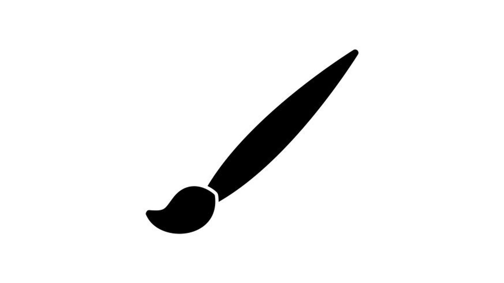
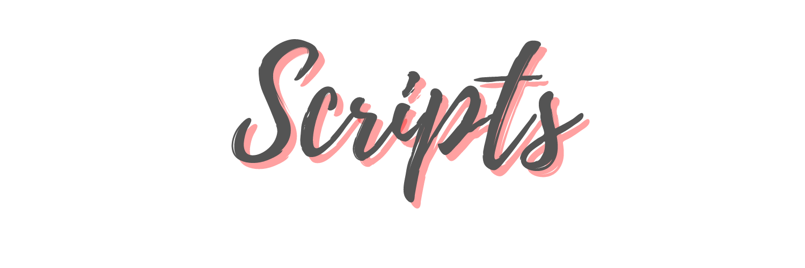

Hello there!

Those are my different bspwm and (no longer supported) openbox themes dotfiles, hope you find something useful in this mess ^^

I hope you understand everything here. :wink:

Here are some details about my setup:
- **WM**                           : [Openbox](http://openbox.org/wiki/Main_Page) :art: 4 changable themes/mode!
- **DM**                           : [SLiM](https://wiki.archlinux.org/index.php/SLiM) :blossom: login themes Mac looks like!
- **Shell**                        : [Zsh](https://wiki.archlinux.org/index.php/zsh) :shell: with [oh my zsh](https://github.com/ohmyzsh/ohmyzsh) framework!
- **Terminal**                     : [URxvt](https://wiki.archlinux.org/index.php/Rxvt-unicode), [Termite](https://wiki.archlinux.org/index.php/Termite)
- **Openbox Menu**                 : [Obmenu-generator](https://github.com/trizen/obmenu-generator)
- **Panel**                        : [Tint2](https://wiki.archlinux.org/index.php/Tint2) :shaved_ice: material icon font!
- **Compositor**                   : [Picom](https://github.com/yshui/picom)
- **Notify Daemon**                : [Dunst](https://wiki.archlinux.org/index.php/Dunst) :leaves: minimalism!
- **Application Launcher**         : [Rofi](https://github.com/davatorium/rofi) :rocket: apps & sidebar menu!
- **File Manager**                 : [Thunar](https://wiki.archlinux.org/index.php/Thunar) :bookmark: customized sidebar & icon!
- **Text Editor**                  : [Geany](https://www.geany.org/), [nano](https://www.nano-editor.org/), [vim](https://www.vim.org/)

<a href="https://youtu.be/_PTp5mh5_vQ"></a>


## PinkNord Alternative [(Fleon based)](https://github.com/owl4ce/dotfiles)


## PinkNord


<br/><br/>

## Gruvbox


<br/><br/>

## SolarizedDark


# Custom Theme Swap Utility

## Click the brush icon


## Choose the rice that you desire


## Nice! Now you have a completely look and feel for your Linux desktop!




## [WARNING]: Installation scripts are still work in progress. Use them at your own risk!!
### [WARNING!]: These are my personal config files, executing these scripts will overwrite several files in your system, only execute these in case you have a backup of your files.

## Download
```
mkdir -p ~/Documents/git-lab && git clone https://github.com/zodd18/dotfiles.git ~/Documents/git-lab
```

## Executing the script
You can install one of them by running the setup executable.

Installing necessary packages:

[WARNING!]: Support for Arch Linux based systems only (installation via pacman).

Use:

```shell
./setup.sh <ARG> 
```

where 
```<ARG>```
may be:

```
pacman       - installs necessary packages from pacman
aur          - installs necessary packages from AUR and external sources
themes       - installs .themes, .icons, .fonts, wallpapers and necessary/personal scripts
```

You can also do:


```shell
./setup.sh <ARG> <THEME_NAME>
```

where 
```<ARG>```
may be:

```
rice         - installs <RICE_NAME> rice
all          - installs all at once: pacman packages, aur packages, GTK themes, etc. And finally installs <RICE_NAME> theme if this argument was passed
```

where 
```<RICE_NAME>```
may be:

```
pink-nord               - Pink Nord look
gruvbox                 - Classic Gruvbox look
solarized-dark          - Solarized Dark look
pink-nord-alternative   - Based on Fleon look
```

example:

```
setup.sh all pink-nord
```
(this command would install all necessary packages, themes, icons and would install pink-nord rice)

### Recomendation
You can try to install all at once by using "all" argument, however I'd install it one by one in case any installation fails. 
I'd follow this order: pacman, aur, themes, rice.

# Deprecated (old rices, they need a lot of cleaning)
```
nord                    - Classic Nord look
dracula                 - Classic Dracula look
doombox                 - Doom version of gruvbox
```

